phyloseq
================

  - [Partie bonus: Handoff to
    phyloseq](#partie-bonus-handoff-to-phyloseq)
      - [Importer dans phyloseq :](#importer-dans-phyloseq)
      - [Visualisez la diversité alpha
        :](#visualisez-la-diversité-alpha)
      - [Ordinate:](#ordinate)
      - [Bar plot :](#bar-plot)
  - [Loading the data](#loading-the-data)
  - [Filtering](#filtering)
      - [Taxonomic Filtering](#taxonomic-filtering)
      - [Filtrage de la prévalence](#filtrage-de-la-prévalence)
      - [Agglomerate taxa](#agglomerate-taxa)
      - [Abundance value
        transformation](#abundance-value-transformation)
      - [Subset by taxonomy](#subset-by-taxonomy)
      - [Preprocessing](#preprocessing)
  - [Different Ordination
    Projections](#different-ordination-projections)
  - [Why are the ordination plots so far from
    square?](#why-are-the-ordination-plots-so-far-from-square)
      - [PCA on ranks](#pca-on-ranks)
      - [Canonical correspondence](#canonical-correspondence)
  - [Supervised learning](#supervised-learning)
  - [Graph-based analyses](#graph-based-analyses)
      - [Creating and plotting graphs](#creating-and-plotting-graphs)
      - [Graph-based two-sample tests](#graph-based-two-sample-tests)
      - [Linear modeling](#linear-modeling)
      - [Hierarchical multiple testing](#hierarchical-multiple-testing)
  - [Multitable techniques](#multitable-techniques)

# Partie bonus: Handoff to phyloseq

Le package phyloseq est un cadre puissant pour une analyse plus
approfondie des données sur le microbiome .

## Importer dans phyloseq :

Ici on va Rapporter le numéro de version du package phyloseq, ce package
permet d’importer, stocker, analyser et afficher graphiquement des
données de séquençage phylogénétique complexes qui ont déjà été
regroupées en unités taxonomiques opérationnelles (OTU):

``` r
library(phyloseq); packageVersion("phyloseq")
```

    ## [1] '1.32.0'

Ici on va Rapporter le numéro de version du Biostrings, ce package
permet une manipulation efficace des chaînes biologiques:

``` r
library(Biostrings); packageVersion("Biostrings")
```

    ## [1] '2.56.0'

Ici on va Rapporter le numéro de version du package ggplot2, ce package
permet la création déclarative de graphiques:

``` r
library(ggplot2); packageVersion("ggplot2")
```

    ## [1] '3.3.2'

theme\_set pour remplacer le thème actuel complétement parce que le
thème classique de ggplot2 sombre sur lumière. les présentations
graphiques peuvent être plus “jolies” visialement avec cette commande
alors.

``` r
theme_set(theme_bw())
```

``` r
load("02_data-analysis")
```

On veut construire un échantillon simple à partir des informations
encodées dans les noms de fichiers. on impliquera la lecture des sample
data à partir d’un fichier. nous voulons mettre à jour les noms de
lignes de seqtab.mochin pour se faire on va créer une variable
samples.out et on lui assigne la valeur des résultats la fonction
rownames.

``` r
samples.out <- rownames(seqtab.nochim)
subject <- sapply(strsplit(samples.out, "D"), `[`, 1)
gender <- substr(subject,1,1)
subject <- substr(subject,2,999)
day <- as.integer(sapply(strsplit(samples.out, "D"), `[`, 2))
samdf <- data.frame(Subject=subject, Gender=gender, Day=day)
samdf$When <- "Early"
samdf$When[samdf$Day>100] <- "Late"
rownames(samdf) <- samples.out
```

On crée d’abbord une variable ps et on assigne à cette variable les
valeurs des résultas de la fonction phyloseq, qui va permettre de créer
des objets de classe phyloseq, phyloseq () permet de construire un objet
de niveau expérience à partir de ses données de composant : classe
otu\_table, sample\_data… avec la commande ps, on va regrouper tout dans
un objet phyloseq.

``` r
ps <- phyloseq(otu_table(seqtab.nochim, taxa_are_rows=FALSE), 
               sample_data(samdf), 
               tax_table(taxa))
ps <- prune_samples(sample_names(ps) != "Mock", ps) # Remove mock sample
```

avec cette commande, on va faire apparaître les nouveaux taxons courts
dans des tableaux et des graphiques. Et on va pouvoir récupérer les
séquences d’ADN correspondant à chaque ASV (c’est plus pratique
d’utiliser les noms cours pour nos ASV que la séquence d’ADN
compléte), et donc on va stocker les séquences d’ADN dans les ASV
d’abbord pour pouvoir faire ça. Le package Biostrings contient des
classes et des fonctions pour représenter des chaînes biologiques telles
que l’ADN, l’ARN et les acides aminés.

``` r
dna <- Biostrings::DNAStringSet(taxa_names(ps))
names(dna) <- taxa_names(ps)
ps <- merge_phyloseq(ps, dna)
taxa_names(ps) <- paste0("ASV", seq(ntaxa(ps)))
ps
```

    ## phyloseq-class experiment-level object
    ## otu_table()   OTU Table:         [ 232 taxa and 19 samples ]
    ## sample_data() Sample Data:       [ 19 samples by 4 sample variables ]
    ## tax_table()   Taxonomy Table:    [ 232 taxa by 7 taxonomic ranks ]
    ## refseq()      DNAStringSet:      [ 232 reference sequences ]

## Visualisez la diversité alpha :

la fonction plot\_richness permet de tracer la diversité Alpha, le
graphe généré par cette fonction inclura chaque échantillion dans
physeq, l’argument X permet de les regroupés sur l’axe horizontal,
measures va permetre de spécifier les mesures Shannon et simpson et
color permet de choisir la couleur.

``` r
plot_richness(ps, x="Day", measures=c("Shannon", "Simpson"), color="When")
```

    ## Warning in estimate_richness(physeq, split = TRUE, measures = measures): The data you have provided does not have
    ## any singletons. This is highly suspicious. Results of richness
    ## estimates (for example) are probably unreliable, or wrong, if you have already
    ## trimmed low-abundance taxa from the data.
    ## 
    ## We recommended that you find the un-trimmed data and retry.

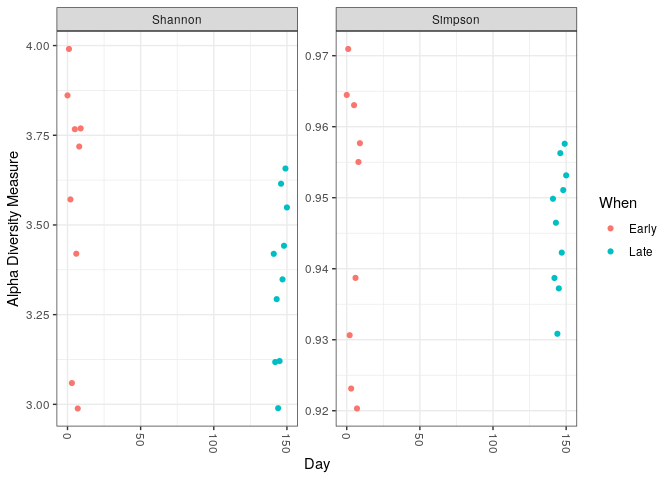<!-- -->

on remarque aucune différence significative dans la diversité alpha
entre les échantillions early et late.

## Ordinate:

ici on va Transformer les données en proportions appropriées pour les
distances de Bray-Curtis

``` r
# Transform data to proportions as appropriate for Bray-Curtis distances
ps.prop <- transform_sample_counts(ps, function(otu) otu/sum(otu))
ord.nmds.bray <- ordinate(ps.prop, method="NMDS", distance="bray")
```

plot\_ordination va permettre de tracer l’ordination NMDS qui est une
approche d’analyse de gradient indirecte qui produit une ordination
basée sur une matrice de distance ou de dissimilarité.

``` r
plot_ordination(ps.prop, ord.nmds.bray, color="When", title="Bray NMDS")
```

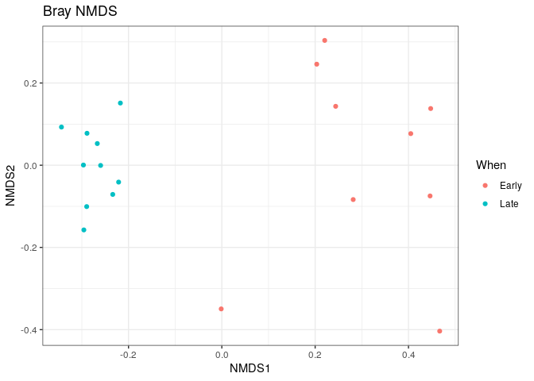<!-- -->

On remarque que les échantions tardifs et précoces sont bien éloignés.

## Bar plot :

cela va permettre d’obtenir un bar plot de la ditribution taxonomique
des 20 premiers séquences.

``` r
top20 <- names(sort(taxa_sums(ps), decreasing=TRUE))[1:20]
ps.top20 <- transform_sample_counts(ps, function(OTU) OTU/sum(OTU))
ps.top20 <- prune_taxa(top20, ps.top20)
plot_bar(ps.top20, x="Day", fill="Family") + facet_wrap(~When, scales="free_x")
```

<!-- -->

On remarque que la distrubition taxonomiques de ces 20 séquences des
échantillions early est assez proche des late.

# Loading the data

on va recharger l’objet phyloseq, pour qu’il soit complet en temps que
objet initial, on va accéder au fichier via le site github:

``` r
ps_connect <-url("https://raw.githubusercontent.com/spholmes/F1000_workflow/master/data/ps.rds")
ps = readRDS(ps_connect)
ps
```

    ## phyloseq-class experiment-level object
    ## otu_table()   OTU Table:         [ 389 taxa and 360 samples ]
    ## sample_data() Sample Data:       [ 360 samples by 14 sample variables ]
    ## tax_table()   Taxonomy Table:    [ 389 taxa by 6 taxonomic ranks ]
    ## phy_tree()    Phylogenetic Tree: [ 389 tips and 387 internal nodes ]

# Filtering

on va explorer graphiquement la prévalence des taxons, et l’utliser
comme critère de filtrage. Ce filtrage va permettre d’éviter de passer
beucoup de temps à analyser des taxons qui n’étaient que rarement vus
parmi les échantillions, et aussi filter les artefacts du processus de
collecte de données.

## Taxonomic Filtering

On veut filter les caractéristiques taxonomiques pour lesquelles une
taxonomie de haut rang n’a pas pu être attribuée, qui sont des artefacts
de séquence qui n’existent pas dans la nature.

On va d’abord créer un tableau des nombres de lectures pour chaque
phylum présent dans l’ensemble de donnés:

Afficher les classements disponibles dans l’ensemble de données par la
fonction rank\_names() :

``` r
# Show available ranks in the dataset
rank_names(ps)
```

    ## [1] "Kingdom" "Phylum"  "Class"   "Order"   "Family"  "Genus"

Ici on a Kingdom, Phylum …

Créer un tableau, le nombre de fonctionnalités pour chaque phylum par la
fonction table() Phylum est un classement taxonomique utile à utliser
pour le filtrage taxonomique

``` r
# Create table, number of features for each phyla
table(tax_table(ps)[, "Phylum"], exclude = NULL)
```

    ## 
    ##              Actinobacteria               Bacteroidetes 
    ##                          13                          23 
    ## Candidatus_Saccharibacteria   Cyanobacteria/Chloroplast 
    ##                           1                           4 
    ##         Deinococcus-Thermus                  Firmicutes 
    ##                           1                         327 
    ##                Fusobacteria              Proteobacteria 
    ##                           1                          11 
    ##                 Tenericutes             Verrucomicrobia 
    ##                           1                           1 
    ##                        <NA> 
    ##                           6

Cela montre quelques phylums pour lesquels une seule caractéristique a
été observée. six caractéristiques ont été annotées avec un Phylum of
NA. Ces fonctionnalités sont probablement des artefacts dans un ensemble
de données comme celui-ci et doivent être supprimées.

Ici on va modifier la valeur de ps quand avait créer pour supprimer les
fonctionnalités avec une annotation de phylum ambiguïe.

``` r
ps <- subset_taxa(ps, !is.na(Phylum) & !Phylum %in% c("", "uncharacterized"))
```

on va explorer la prévalence des caractéristiques dans l’ensemble de
données, qu’on a définit comme le nombre d’échantillons dans lesquels un
taxon apparaît au moins une fois.On va d’abord calculer la prévalence de
chaque fonctionnalité, et stocker-la en tant que data.frame, et puis
ajouter la taxonomie et le nombre total de lectures à ce data.frame.

``` r
# Compute prevalence of each feature, store as data.frame
prevdf = apply(X = otu_table(ps),
               MARGIN = ifelse(taxa_are_rows(ps), yes = 1, no = 2),
               FUN = function(x){sum(x > 0)})
# Add taxonomy and total read counts to this data.frame
prevdf = data.frame(Prevalence = prevdf,
                    TotalAbundance = taxa_sums(ps),
                    tax_table(ps))
```

la fonction ddply permet de fractionner Le Bloc De Données, Appliquer La
Fonction Et Renvoyer Les Résultats Dans Un Bloc De Données.

``` r
plyr::ddply(prevdf, "Phylum", function(df1){cbind(mean(df1$Prevalence),sum(df1$Prevalence))})
```

    ##                         Phylum         1     2
    ## 1               Actinobacteria 120.15385  1562
    ## 2                Bacteroidetes 265.52174  6107
    ## 3  Candidatus_Saccharibacteria 280.00000   280
    ## 4    Cyanobacteria/Chloroplast  64.25000   257
    ## 5          Deinococcus-Thermus  52.00000    52
    ## 6                   Firmicutes 179.24771 58614
    ## 7                 Fusobacteria   2.00000     2
    ## 8               Proteobacteria  59.09091   650
    ## 9                  Tenericutes 234.00000   234
    ## 10             Verrucomicrobia 104.00000   104

Deinococcus-Thermus est apparu dans 52 échantillions et Fusobacteria
dans 2, ils seront filtrés de l’ensemble de données..

On va d’abbord Définir les phylums à filtrer (filterPhyla), ces phylum
sont Deinococcus-Thermus et Fusobacteria.En suite on va Filtrer les
entrées avec unidentified Phylum.

``` r
# Define phyla to filter
filterPhyla = c("Fusobacteria", "Deinococcus-Thermus")
# Filter entries with unidentified Phylum.
ps1 = subset_taxa(ps, !Phylum %in% filterPhyla)
ps1
```

    ## phyloseq-class experiment-level object
    ## otu_table()   OTU Table:         [ 381 taxa and 360 samples ]
    ## sample_data() Sample Data:       [ 360 samples by 14 sample variables ]
    ## tax_table()   Taxonomy Table:    [ 381 taxa by 6 taxonomic ranks ]
    ## phy_tree()    Phylogenetic Tree: [ 381 tips and 379 internal nodes ]

## Filtrage de la prévalence

explorer la relation entre la prévalence et le nombre total de lectures
pour chaque caractéristique. Parfois, cela révèle des valeurs aberrantes
qui devraient probablement être supprimées et fournit également des
informations sur les plages de l’une ou l’autre des fonctionnalités qui
pourraient être utiles. Il se peut même que différents types d’inférence
en aval nécessitent ici des choix différents. On va nclure une
estimation du paramètre par la fonction geom\_hline

``` r
# Subset to the remaining phyla
prevdf1 = subset(prevdf, Phylum %in% get_taxa_unique(ps1, "Phylum"))
ggplot(prevdf1, aes(TotalAbundance, Prevalence / nsamples(ps),color=Phylum)) +
  # Include a guess for parameter
  geom_hline(yintercept = 0.05, alpha = 0.5, linetype = 2) +  geom_point(size = 2, alpha = 0.7) +
  scale_x_log10() +  xlab("Total Abundance") + ylab("Prevalence [Frac. Samples]") +
  facet_wrap(~Phylum) + theme(legend.position="none")
```

<!-- -->

les graphes représentent la prévalence des taxons par rapport aux
dénombrements totaux. Cela va permettre de sélectionner les paramètres
de filtrage, comme les critères de prévalence minimale que nous
utiliserons pour filtrer les données ci-dessus. on remarque que les
Fimicutes contiennet plus de taxons différents. les graphes ne montre
aucune séparation naturelle évidente.

Définir le seuil de prévalence (prevalenceThreshold) à 5% du total des
échantillons.

``` r
# Define prevalence threshold as 5% of total samples
prevalenceThreshold = 0.05 * nsamples(ps)
prevalenceThreshold
```

    ## [1] 18

définir les taxons qu’on va garder (keepTaxa) Exécuter le filtre de
prévalence par la fonction prune\_taxa

``` r
# Execute prevalence filter, using `prune_taxa()` function
keepTaxa = rownames(prevdf1)[(prevdf1$Prevalence >= prevalenceThreshold)]
ps2 = prune_taxa(keepTaxa, ps)
```

## Agglomerate taxa

ici on va agglomérer les caractéristiques des données correspondant à
des taxons étroitement apparentés

on va connaîte Combien de genres seraient présents après le filtrage par
la fonction length.

``` r
# How many genera would be present after filtering?
length(get_taxa_unique(ps2, taxonomic.rank = "Genus"))
```

    ## [1] 49

on va filter 49 genres.

``` r
ps3 = tax_glom(ps2, "Genus", NArm = TRUE)
```

on va préciser la hauter d’arbre correspondant à la distance
phylogénique entre les entités qui doivent définir leur regroupement h1
à 0.4

``` r
h1 = 0.4
ps4 = tip_glom(ps2, h = h1)
```

Ici, la plot\_tree()fonction de phyloseq compare les données originales
non filtrées, l’arbre après l’agglomération taxonoïque et l’arbre après
l’agglomération phylogénétique. Ceux-ci sont stockés en tant qu’objets
de tracé séparés, puis rendus ensemble dans un graphique combiné à
l’aide de gridExtra::grid.arrange.

``` r
multiPlotTitleTextSize = 15
p2tree = plot_tree(ps2, method = "treeonly",
                   ladderize = "left",
                   title = "Before Agglomeration") +
  theme(plot.title = element_text(size = multiPlotTitleTextSize))
p3tree = plot_tree(ps3, method = "treeonly",
                   ladderize = "left", title = "By Genus") +
  theme(plot.title = element_text(size = multiPlotTitleTextSize))
p4tree = plot_tree(ps4, method = "treeonly",
                   ladderize = "left", title = "By Height") +
  theme(plot.title = element_text(size = multiPlotTitleTextSize))
```

regrouper les plot ensemble avec la fonction grid.arrange

``` r
library("gridExtra")
```

    ## 
    ## Attaching package: 'gridExtra'

    ## The following object is masked from 'package:BiocGenerics':
    ## 
    ##     combine

``` r
# group plots together
grid.arrange(nrow = 1, p2tree, p3tree, p4tree)
```

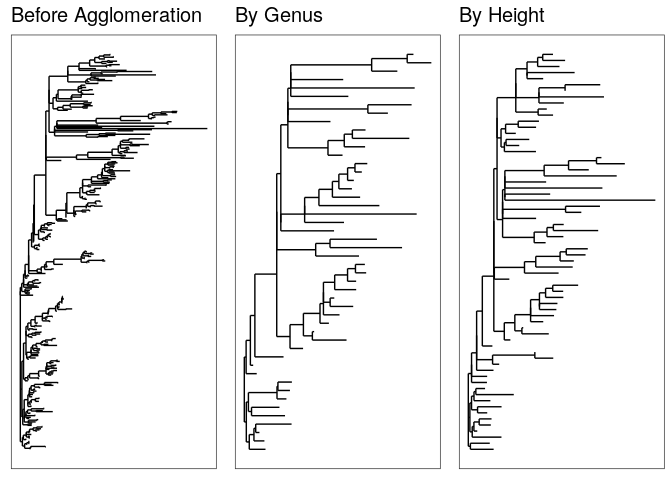<!-- -->

la fiqure représente les différents types d’agglomération. à gauche on a
l’arbre avant agglomération, au milieu l’arbre d’agglomération de genre,
et à droite l’arbre d’agglomération phylogénétique à la distance qu’on a
préciser 0.4.

## Abundance value transformation

on va définir la fonction plot\_abundance qui utilise la fonction
phyloseq pour définir un graphique d’abandance relative. cela va
permettre de comparer facilement les différences d’échelle et de
distribution des valeurs d’abondance avant et arès transformation.

``` r
plot_abundance = function(physeq,title = "",
                          Facet = "Order", Color = "Phylum"){
  # Arbitrary subset, based on Phylum, for plotting
  p1f = subset_taxa(physeq, Phylum %in% c("Firmicutes"))
  mphyseq = psmelt(p1f)
  mphyseq <- subset(mphyseq, Abundance > 0)
  ggplot(data = mphyseq, mapping = aes_string(x = "sex",y = "Abundance",
                              color = Color, fill = Color)) +
    geom_violin(fill = NA) +
    geom_point(size = 1, alpha = 0.3,
               position = position_jitter(width = 0.3)) +
    facet_wrap(facets = Facet) + scale_y_log10()+
    theme(legend.position="none")
}
```

la fonction transform\_sample\_counts peret de fournir une interface
flexible pour définir de nouvelles fonctions pour accomplir les
transformations de données de comptage du microbiome. On va donc
transformer en abondance relative et enregistrer comme nouvel objet.

``` r
# Transform to relative abundance. Save as new object.
ps3ra = transform_sample_counts(ps3, function(x){x / sum(x)})
```

Ici on va tracer les valeurs d’abondance d’avant plotBefore et après la
transformation plotAfter, et on va combiner les deux plot en un seul
graphe avec la fonction grid.arrange.

``` r
plotBefore = plot_abundance(ps3,"")
plotAfter = plot_abundance(ps3ra,"")
# Combine each plot into one graphic.
grid.arrange(nrow = 2,  plotBefore, plotAfter)
```

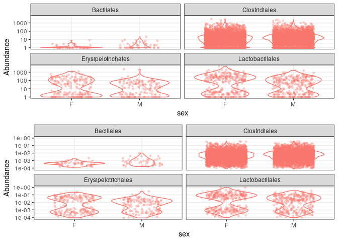<!-- -->

les graphes permettent la comparaison des abondances d’origine et et les
abandances relatives.

## Subset by taxonomy

on voit dans la figure précidente que Lactobacillales semble être un
ordre taxonomique avec un profil d’abondance bimodal dans les données.
Et pour avoir une explication taxonomique de ce modèle on va tracer
uniquement cet ordre taxonomique par la fonction plot, en spécifions un
rang taxnomique plus précis.

``` r
psOrd = subset_taxa(ps3ra, Order == "Lactobacillales")
plot_abundance(psOrd, Facet = "Genus", Color = NULL)
```

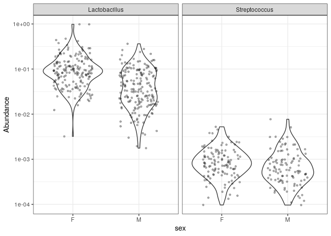<!-- -->

le premier graphique montre les abondances relatives de l’ordre
taxonomique des Lactobacillales, regroupées par sexe et genre d’hôte. le
deuxième est celui de Streptococcus. Ici, il est clair que la
distribution biomodale apparente des Lactobacillales sur la parcelle
précédente était le résultat d’un mélange de deux genres différents,
avec l’ abondance relative typique de Lactobacillus beaucoup plus grande
que Streptococcus .

On va installer quelque packages disponibles pour des analyses
complémentaires

``` r
.cran_packages <- c( "shiny","miniUI", "caret", "pls", "e1071", "ggplot2", "randomForest", "dplyr", "ggrepel", "nlme", "devtools",
                  "reshape2", "PMA", "structSSI", "ade4",
                  "ggnetwork", "intergraph", "scales")
.github_packages <- c("jfukuyama/phyloseqGraphTest")
.bioc_packages <- c("genefilter", "impute")
# Install CRAN packages (if not already installed)
.inst <- .cran_packages %in% installed.packages()
if (any(!.inst)){
  install.packages(.cran_packages[!.inst],repos = "http://cran.rstudio.com/")
}
.inst <- .github_packages %in% installed.packages()
if (any(!.inst)){
  devtools::install_github(.github_packages[!.inst])
}

.inst <- .bioc_packages %in% installed.packages()
if(any(!.inst)){
 BiocManager::install(.bioc_packages[!.inst])
}
```

## Preprocessing

On va ajouter quelques colonnes dans des exemples d’analyses de données
multitables, à l’aide d’une étude dans laquelle des mesures d’abondance
métabolomique et microbienne ont été collectées sur les mêmes
échantillons, pour démontrer que le flux de travail général présenté
ici peut être adapté au cadre multitable.

``` r
qplot(sample_data(ps)$age, geom = "histogram",binwidth=20) + xlab("age")
```

<!-- -->

cette figure est un histogramme des groupes d’âge. Elle montre que la
covariable d’âge appartient à trois grappes distinctes. Nous voyons que
les âges des souris sont répartis en deux groupes, et nous faisons donc
une variable catégorielle correspondant aux souris jeunes, d’âge moyen
et âgées.

ici on va enregistrer le nombre total de dénombrements observés dans
chaque échantillon et transformer les données en logarithme sous forme
de transformation de stabilisation de la variance approximative.

``` r
qplot(log10(rowSums(otu_table(ps))),binwidth=0.2) +
  xlab("Logged counts-per-sample")
```

<!-- -->

cette figure est un histogramme comparant les profondeurs de lecture
brutes et transformées en journal.

on va examiner l’analyse des coordonnées principales (PCoA) avec la
dissemblance de Bray-Curtis sur la distance Unifrac pondérée.

``` r
sample_data(ps)$age_binned <- cut(sample_data(ps)$age,
                          breaks = c(0, 100, 200, 400))
levels(sample_data(ps)$age_binned) <- list(Young100="(0,100]", Mid100to200="(100,200]", Old200="(200,400]")
sample_data(ps)$family_relationship=gsub(" ","",sample_data(ps)$family_relationship)
pslog <- transform_sample_counts(ps, function(x) log(1 + x))
out.wuf.log <- ordinate(pslog, method = "MDS", distance = "wunifrac")
```

    ## Warning in UniFrac(physeq, weighted = TRUE, ...): Randomly assigning root as --
    ## GCAAGCGTTGTCCGGATTTATTGGGCGTAAAGCGAGCGCAGGCGGTTTCTTAAGTCTGATGTGAAAGCCCCCGGCTCAACCGGGGAGGGTCATTGGAAACTGGGAGACTTGAGTGCAGAAGAGGAGAGTGGAATTCCATGTGTAGCGGTGAAATGCGTAGATATATGGAGGAACACCAGTGGCGAAGGCGGCTCTCTGGTCTGTAACTGACGCTGAGGCTCGAAAGCGTGGGGAG
    ## -- in the phylogenetic tree in the data you provided.

``` r
evals <- out.wuf.log$values$Eigenvalues
plot_ordination(pslog, out.wuf.log, color = "age_binned") +
  labs(col = "Binned Age") +
  coord_fixed(sqrt(evals[2] / evals[1]))
```

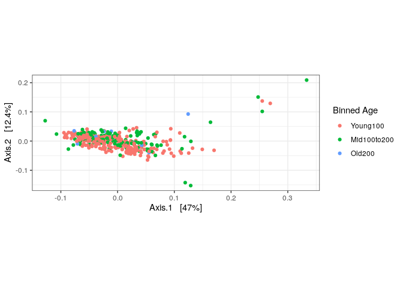<!-- -->

cette figure montrant l’ordination sur les données d’abondance
enregistrées révèle quelques valeurs aberrantes. Il s’agit des
échantillons des femelles 5 et 6 au jour 165 et des échantillons des
mâles 3, 4, 5 et 6 au jour 175. Nous les retirerons, car nous nous
intéressons principalement aux relations entre les non- points
aberrants.

on va vérifier les deux valeurs aberrantes féminines - elles ont été
reprises par le même OTU / ASV, qui a une abondance relative de plus de
90% dans chacune d’elles. C’est la seule fois dans l’ensemble de données
que cette ASV a une abondance relative aussi élevée - le reste du temps,
elle est inférieure à 20%. En particulier, sa diversité est de loin la
plus faible de tous les échantillons.

on va calculer l’abandance relative de chaque OTU présent dans
l’échantillion rel\_abund. la fonction qplot va créer des plots:

``` r
rel_abund <- t(apply(otu_table(ps), 1, function(x) x / sum(x)))
qplot(rel_abund[, 12], geom = "histogram",binwidth=0.05) +
  xlab("Relative abundance")
```

<!-- -->

# Different Ordination Projections

calculer les ordinations

``` r
outliers <- c("F5D165", "F6D165", "M3D175", "M4D175", "M5D175", "M6D175")
ps <- prune_samples(!(sample_names(ps) %in% outliers), ps)
```

rowsum va permettre de Sommer les valeurs des objets raster par ligne On
va supprimer les échantillions avec moins de 1000 lectures.

``` r
which(!rowSums(otu_table(ps)) > 1000)
```

    ## F5D145 M1D149   M1D9 M2D125  M2D19 M3D148 M3D149   M3D3   M3D5   M3D8 
    ##     69    185    200    204    218    243    244    252    256    260

la fonction transform\_sample\_counts va permettre de transformer les
valeurs d’abondance

``` r
ps <- prune_samples(rowSums(otu_table(ps)) > 1000, ps)
pslog <- transform_sample_counts(ps, function(x) log(1 + x))
```

On va effectuer une PCoa en utilisant Bray-Curtis

``` r
out.pcoa.log <- ordinate(pslog,  method = "MDS", distance = "bray")
evals <- out.pcoa.log$values[,1]
plot_ordination(pslog, out.pcoa.log, color = "age_binned",
                  shape = "family_relationship") +
  labs(col = "Binned Age", shape = "Litter")+
  coord_fixed(sqrt(evals[2] / evals[1]))
```

<!-- -->

On voit qu’il y a un effet d’âge assez important qui est cohérent entre
toutes les souris, mâles et femelles, et de portées différentes.

On va examiner l’analyse de PCoA double (DPCoa), elle va fournir une
représentation biplot des échantillions et des catégories.

``` r
out.dpcoa.log <- ordinate(pslog, method = "DPCoA")
evals <- out.dpcoa.log$eig
plot_ordination(pslog, out.dpcoa.log, color = "age_binned", label= "SampleID",
                  shape = "family_relationship") +
  labs(col = "Binned Age", shape = "Litter")+
  coord_fixed(sqrt(evals[2] / evals[1]))
```

<!-- -->

Nous voyons à nouveau que le deuxième axe correspond aux souris jeunes
vs âgées, et le biplot suggère une interprétation du deuxième axe: les
échantillons qui ont des scores plus élevés sur le deuxième axe ont
plus de taxons de Bacteroidetes et un sous-ensemble de Firmicutes. Nous
avons le premier axe explique 75% de la variabilité, environ 9 fois
celle du deuxième axe; cela se traduit par la forme allongée du tracé
d’ordination.

``` r
plot_ordination(pslog, out.dpcoa.log, type = "species", color = "Phylum") +
  coord_fixed(sqrt(evals[2] / evals[1]))
```

<!-- -->

ce graphe représente les taxons responsables des axes 1 et 2.

regarder les résultats du PCoA avec Unifrac pondéré.

``` r
out.wuf.log <- ordinate(pslog, method = "PCoA", distance ="wunifrac")
```

    ## Warning in UniFrac(physeq, weighted = TRUE, ...): Randomly assigning root as --
    ## GCAAGCGTTGTCCGGAATTACTGGGTGTAAAGGGAGCGTAGGCGGGAGGATAAGTTGAATGTGAAATCTATGGGCTCAACCTATAGCTGCGTTCAAAACTGTTCTTCTTGAGTGAAGTAGAGGCAGGCGGAATTCCTAGTGTAGCGGTGAAATGCGTAGATATTAGGAGGAACACCAGTGGCGAAGGCGGCCTGCTGGGCTTTTACTGACGCTGAGGCTCGAAAGCGTGGGTAGC
    ## -- in the phylogenetic tree in the data you provided.

``` r
evals <- out.wuf.log$values$Eigenvalues
plot_ordination(pslog, out.wuf.log, color = "age_binned",
                  shape = "family_relationship") +
  coord_fixed(sqrt(evals[2] / evals[1])) +
  labs(col = "Binned Age", shape = "Litter")
```

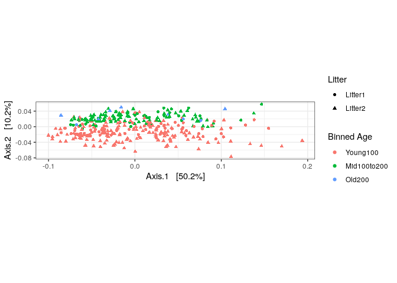<!-- -->

nous constatons que le deuxième axe est associé à un effet d’âge, assez
similaire au DPCoA. Cependant, lorsque nous comparons les biplots, nous
voyons que le DPCoA a donné une interprétation beaucoup plus claire du
deuxième axe, par rapport à l’Unifrac pondéré.

# Why are the ordination plots so far from square?

## PCA on ranks

On va créer une nouvelle matrice abund, représantant les abondances par
leur rangs où le microbe avec le plus petit dans un échantillon est
mappé au rang 1, au deuxième rang le plus petit 2, etc.

``` r
abund <- otu_table(pslog)
abund_ranks <- t(apply(abund, 1, rank))
```

Les microbes dont le rang est inférieur à un certain seuil doivent être
liés à 1. Les rangs des autres microbes sont décalés vers le bas, il n’y
a donc pas de grand écart entre les rangs.

``` r
abund_ranks <- abund_ranks - 329
abund_ranks[abund_ranks < 1] <- 1
```

``` r
library(dplyr)
```

    ## 
    ## Attaching package: 'dplyr'

    ## The following object is masked from 'package:gridExtra':
    ## 
    ##     combine

    ## The following objects are masked from 'package:Biostrings':
    ## 
    ##     collapse, intersect, setdiff, setequal, union

    ## The following object is masked from 'package:XVector':
    ## 
    ##     slice

    ## The following objects are masked from 'package:IRanges':
    ## 
    ##     collapse, desc, intersect, setdiff, slice, union

    ## The following objects are masked from 'package:S4Vectors':
    ## 
    ##     first, intersect, rename, setdiff, setequal, union

    ## The following objects are masked from 'package:BiocGenerics':
    ## 
    ##     combine, intersect, setdiff, union

    ## The following objects are masked from 'package:stats':
    ## 
    ##     filter, lag

    ## The following objects are masked from 'package:base':
    ## 
    ##     intersect, setdiff, setequal, union

``` r
library(reshape2)
abund_df <- melt(abund, value.name = "abund") %>%
  left_join(melt(abund_ranks, value.name = "rank"))
```

    ## Joining, by = c("Var1", "Var2")

``` r
colnames(abund_df) <- c("sample", "seq", "abund", "rank")

abund_df <- melt(abund, value.name = "abund") %>%
  left_join(melt(abund_ranks, value.name = "rank"))
```

    ## Joining, by = c("Var1", "Var2")

``` r
colnames(abund_df) <- c("sample", "seq", "abund", "rank")

sample_ix <- sample(1:nrow(abund_df), 8)
ggplot(abund_df %>%
         filter(sample %in% abund_df$sample[sample_ix])) +
  geom_point(aes(x = abund, y = rank, col = sample),
             position = position_jitter(width = 0.2), size = 1.5) +
  labs(x = "Abundance", y = "Thresholded rank") +
  scale_color_brewer(palette = "Set2")
```

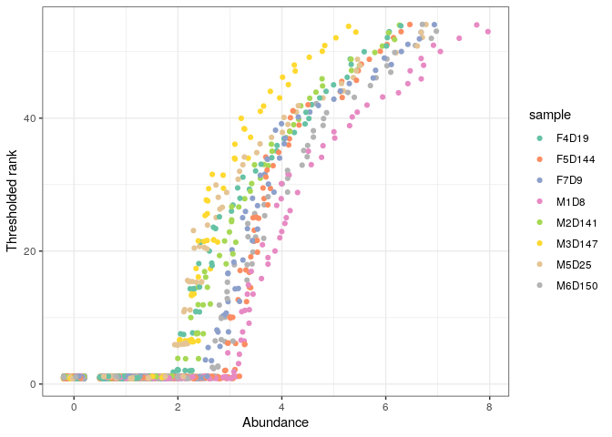<!-- -->

cette figure représente la transformation du seuil de rang

On va effecuer une PCA.

``` r
library(ade4)
ranks_pca <- dudi.pca(abund_ranks, scannf = F, nf = 3)
row_scores <- data.frame(li = ranks_pca$li,
                         SampleID = rownames(abund_ranks))
col_scores <- data.frame(co = ranks_pca$co,
                         seq = colnames(abund_ranks))
tax <- tax_table(ps) %>%
  data.frame(stringsAsFactors = FALSE)
tax$seq <- rownames(tax)
main_orders <- c("Clostridiales", "Bacteroidales", "Lactobacillales",
                 "Coriobacteriales")
tax$Order[!(tax$Order %in% main_orders)] <- "Other"
tax$Order <- factor(tax$Order, levels = c(main_orders, "Other"))
tax$otu_id <- seq_len(ncol(otu_table(ps)))
row_scores <- row_scores %>%
  left_join(sample_data(pslog))
```

    ## Warning in class(x) <- c(setdiff(subclass, tibble_class), tibble_class): Setting
    ## class(x) to multiple strings ("tbl_df", "tbl", ...); result will no longer be an
    ## S4 object

``` r
col_scores <- col_scores %>%
  left_join(tax)
```

``` r
evals_prop <- 100 * (ranks_pca$eig / sum(ranks_pca$eig))
ggplot() +
  geom_point(data = row_scores, aes(x = li.Axis1, y = li.Axis2), shape = 2) +
  geom_point(data = col_scores, aes(x = 25 * co.Comp1, y = 25 * co.Comp2, col = Order),
             size = .3, alpha = 0.6) +
  scale_color_brewer(palette = "Set2") +
  facet_grid(~ age_binned) +
  guides(col = guide_legend(override.aes = list(size = 3))) +
  labs(x = sprintf("Axis1 [%s%% variance]", round(evals_prop[1], 2)),
       y = sprintf("Axis2 [%s%% variance]", round(evals_prop[2], 2))) +
  coord_fixed(sqrt(ranks_pca$eig[2] / ranks_pca$eig[1])) +
  theme(panel.border = element_rect(color = "#787878", fill = alpha("white", 0)))
```

<!-- -->

la figure représente Le biplot résultant de l’ACP après la
transformation de classement tronqué. Les résultats sont similaires aux
analyses PCoA calculées sans appliquer une transformation de classement
tronqué, renforçant notre confiance dans l’analyse sur les données
d’origine.

## Canonical correspondence

L’analyse de correspondance canonique (CCpnA) est une approche de
l’ordination d’une espèce par table d’échantillons qui intègre des
informations supplémentaires sur les échantillons.

La fonction ordinate va permettre d’accéder aux positions biplot

``` r
ps_ccpna <- ordinate(pslog, "CCA", formula = pslog ~ age_binned + family_relationship)
```

Ici on va joindre les scores du site avec les données environnementales
dans la fente pour faciliter l’annotation.

``` r
library(ggrepel)
ps_scores <- vegan::scores(ps_ccpna)
sites <- data.frame(ps_scores$sites)
sites$SampleID <- rownames(sites)
sites <- sites %>%
  left_join(sample_data(ps))
```

    ## Joining, by = "SampleID"

    ## Warning in class(x) <- c(setdiff(subclass, tibble_class), tibble_class): Setting
    ## class(x) to multiple strings ("tbl_df", "tbl", ...); result will no longer be an
    ## S4 object

``` r
species <- data.frame(ps_scores$species)
species$otu_id <- seq_along(colnames(otu_table(ps)))
species <- species %>%
  left_join(tax)
```

    ## Joining, by = "otu_id"

``` r
evals_prop <- 100 * ps_ccpna$CCA$eig[1:2] / sum(ps_ccpna$CA$eig)
ggplot() +
  geom_point(data = sites, aes(x = CCA1, y = CCA2), shape = 2, alpha = 0.5) +
  geom_point(data = species, aes(x = CCA1, y = CCA2, col = Order), size = 0.5) +
  geom_text_repel(data = species %>% filter(CCA2 < -2),
                    aes(x = CCA1, y = CCA2, label = otu_id),
            size = 1.5, segment.size = 0.1) +
  facet_grid(. ~ family_relationship) +
  guides(col = guide_legend(override.aes = list(size = 3))) +
  labs(x = sprintf("Axis1 [%s%% variance]", round(evals_prop[1], 2)),
        y = sprintf("Axis2 [%s%% variance]", round(evals_prop[2], 2))) +
  scale_color_brewer(palette = "Set2") +
  coord_fixed(sqrt(ps_ccpna$CCA$eig[2] / ps_ccpna$CCA$eig[1])*0.45   ) +
  theme(panel.border = element_rect(color = "#787878", fill = alpha("white", 0)))
```

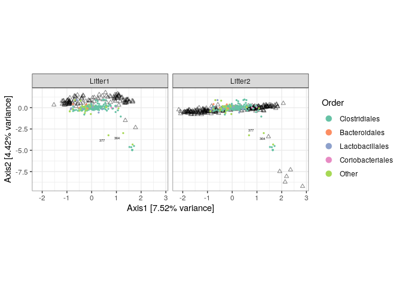<!-- -->

la figure représente les scores souris et bactéries générés par CCpnA.

# Supervised learning

Déviser les données en ensembles d’apprentissage et de test. es
affectations étant effectuées à la souris plutôt que par échantillon,
pour garantir que l’ensemble de test simule de manière réaliste la
collecte de nouvelles données. Une fois que nous avons divisé les
données, nous pouvons utiliser la fonction trainpour ajuster le modèle
PLS.

``` r
library(caret)
```

    ## Loading required package: lattice

``` r
library(phyloseq)
library(lattice)
sample_data(pslog)$age2 <- cut(sample_data(pslog)$age, c(0, 100, 400))
dataMatrix <- data.frame(age = sample_data(pslog)$age2, otu_table(pslog))
# take 8 mice at random to be the training set, and the remaining 4 the test set
trainingMice <- sample(unique(sample_data(pslog)$host_subject_id), size = 8)
inTrain <- which(sample_data(pslog)$host_subject_id %in% trainingMice)
training <- dataMatrix[inTrain,]
testing <- dataMatrix[-inTrain,]
plsFit <- train(age ~ ., data = training,
                method = "pls", preProc = "center")
```

la fonction predict va permettre de prédire les étiquettes de classe sur
l’ensemble de test.

``` r
plsClasses <- predict(plsFit, newdata = testing)
table(plsClasses, testing$age)
```

    ##            
    ## plsClasses  (0,100] (100,400]
    ##   (0,100]        63         0
    ##   (100,400]      10        48

cela a permis de donner un excellent travail de prédiction de l’âge.

Ici on va essayer des forêts aléatoires.

``` r
library(randomForest)
rfFit <- train(age ~ ., data = training, method = "rf",
               preProc = "center", proximity = TRUE)
rfClasses <- predict(rfFit, newdata = testing)
table(rfClasses, testing$age)
```

    ##            
    ## rfClasses   (0,100] (100,400]
    ##   (0,100]        71         9
    ##   (100,400]       2        39

On voit que les forêts aléatoires se comportent également bien à la
tâche de prédiction.

Extraire les cordonnées et fornir les annotations pour les points à
inclure sur le biplot PLS. PLS identifie une sous-espèce pour maximiser
la discrimination entre les classes.

``` r
library(vegan)
```

    ## Loading required package: permute

    ## This is vegan 2.5-7

    ## 
    ## Attaching package: 'vegan'

    ## The following object is masked from 'package:caret':
    ## 
    ##     tolerance

``` r
pls_biplot <- list("loadings" = loadings(plsFit$finalModel),
                   "scores" = scores(plsFit$finalModel))
class(pls_biplot$scores) <- "matrix"

pls_biplot$scores <- data.frame(sample_data(pslog)[inTrain, ],
                                pls_biplot$scores)

tax <- tax_table(ps)@.Data %>%
  data.frame(stringsAsFactors = FALSE)
main_orders <- c("Clostridiales", "Bacteroidales", "Lactobacillales",
                 "Coriobacteriales")
tax$Order[!(tax$Order %in% main_orders)] <- "Other"
tax$Order <- factor(tax$Order, levels = c(main_orders, "Other"))
class(pls_biplot$loadings) <- "matrix"
pls_biplot$loadings <- data.frame(tax, pls_biplot$loadings)
```

``` r
library(tidyverse)
```

    ## ── Attaching packages ─────────────────────────────────────── tidyverse 1.3.0 ──

    ## ✓ tibble  3.0.4     ✓ purrr   0.3.4
    ## ✓ tidyr   1.1.2     ✓ stringr 1.4.0
    ## ✓ readr   1.4.0     ✓ forcats 0.5.0

    ## ── Conflicts ────────────────────────────────────────── tidyverse_conflicts() ──
    ## x dplyr::collapse()       masks Biostrings::collapse(), IRanges::collapse()
    ## x randomForest::combine() masks dplyr::combine(), gridExtra::combine(), BiocGenerics::combine()
    ## x purrr::compact()        masks XVector::compact()
    ## x dplyr::desc()           masks IRanges::desc()
    ## x tidyr::expand()         masks S4Vectors::expand()
    ## x dplyr::filter()         masks stats::filter()
    ## x dplyr::first()          masks S4Vectors::first()
    ## x dplyr::lag()            masks stats::lag()
    ## x purrr::lift()           masks caret::lift()
    ## x randomForest::margin()  masks ggplot2::margin()
    ## x ggplot2::Position()     masks BiocGenerics::Position(), base::Position()
    ## x purrr::reduce()         masks IRanges::reduce()
    ## x dplyr::rename()         masks S4Vectors::rename()
    ## x dplyr::slice()          masks XVector::slice(), IRanges::slice()

``` r
ggplot() +
  geom_point(data = pls_biplot$scores,
             aes(x = Comp.1, y = Comp.2), shape = 2) +
  geom_point(data = pls_biplot$loadings,
             aes(x = 25 * Comp.1, y = 25 * Comp.2, col = Order),
             size = 0.3, alpha = 0.6) +
  scale_color_brewer(palette = "Set2") +
  labs(x = "Axis1", y = "Axis2", col = "Binned Age") +
  guides(col = guide_legend(override.aes = list(size = 3))) +
  facet_grid( ~ age2) +
  theme(panel.border = element_rect(color = "#787878", fill = alpha("white", 0)))
```

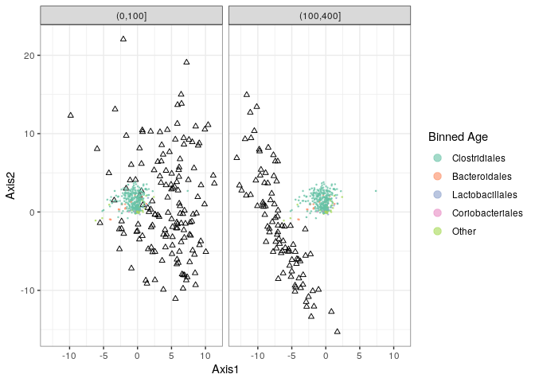<!-- -->

cette figure repésente le biplot produit par PLS. Le biplot affiche des
projections d’echantillions et des coefficients ASV par rapport à ce
sous-espèce.

Calcul de la distance entre les échantillions en fonction de la
fréquence à laquelle l’echantillion se produit dans la même partion
d’arbre dans la procédure d’amorçage de la forêt aléatoire.

``` r
rf_prox <- cmdscale(1 - rfFit$finalModel$proximity) %>%
  data.frame(sample_data(pslog)[inTrain, ])

ggplot(rf_prox) +
  geom_point(aes(x = X1, y = X2, col = age_binned),
             size = 1, alpha = 0.7) +
  scale_color_manual(values = c("#A66EB8", "#238DB5", "#748B4F")) +
  guides(col = guide_legend(override.aes = list(size = 4))) +
  labs(col = "Binned Age", x = "Axis1", y = "Axis2")
```

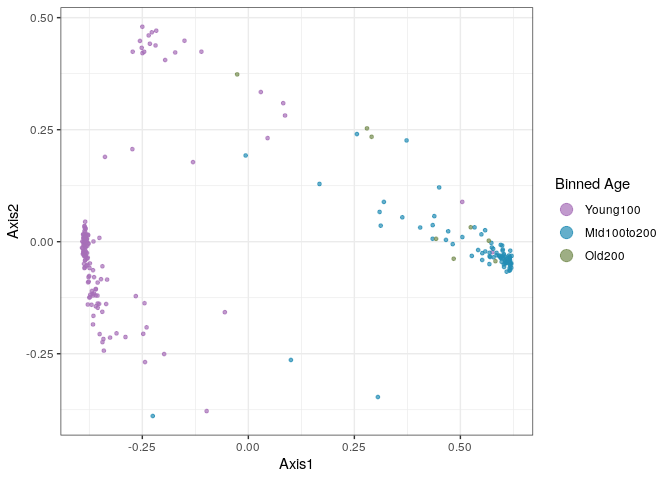<!-- -->

la figure représente le modèle de forêt aléatoire détermine une distance
entre les échantillons, qui peut être entrée dans PCoA pour produire un
graphique de proximité.

identifier le microbe ayant le plus d’influence dans la prédiction
aléatoire de la forêt, Pour mieux comprendre le modèle de forêt
aléatoire ajusté.

``` r
library(randomForest)
as.vector(tax_table(ps)[which.max(importance(rfFit$finalModel)), c("Family", "Genus")])
```

    ## [1] "Erysipelotrichaceae" "Turicibacter"

Il s’agit d’un microbe de la famille des Lachnospiracées et du genre
Roseburia .

Calcul de l’abondance de ce microbe dans les échantillions:

``` r
impOtu <- as.vector(otu_table(pslog)[,which.max(importance(rfFit$finalModel))])
maxImpDF <- data.frame(sample_data(pslog), abund = impOtu)
ggplot(maxImpDF) +   geom_histogram(aes(x = abund)) +
  facet_grid(age2 ~ .) +
  labs(x = "Abundance of discriminative bacteria", y = "Number of samples")
```

    ## `stat_bin()` using `bins = 30`. Pick better value with `binwidth`.

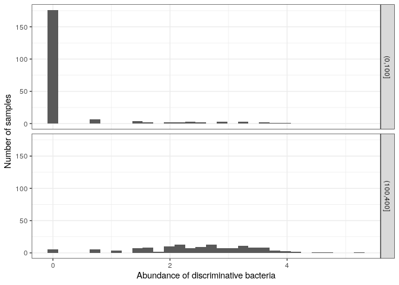<!-- -->

Cette figure représente son abondance dans les échantillons; on voit
qu’il est uniformément très bas de 0 à 100 jours et beaucoup plus
élevé de 100 à 400 jours.

# Graph-based analyses

## Creating and plotting graphs

On va créer un réseau en seuillant la dissimilarité de Jaccard (la
distance par défaut pour la fonction make\_network) à .35, puis nous
ajoutons un attribut aux sommets indiquant de quelle souris provient
l’échantillon et de quelle portée se trouvait la souris.

``` r
library(igraph)
```

    ## 
    ## Attaching package: 'igraph'

    ## The following objects are masked from 'package:purrr':
    ## 
    ##     compose, simplify

    ## The following object is masked from 'package:tidyr':
    ## 
    ##     crossing

    ## The following object is masked from 'package:tibble':
    ## 
    ##     as_data_frame

    ## The following object is masked from 'package:vegan':
    ## 
    ##     diversity

    ## The following object is masked from 'package:permute':
    ## 
    ##     permute

    ## The following objects are masked from 'package:dplyr':
    ## 
    ##     as_data_frame, groups, union

    ## The following object is masked from 'package:Biostrings':
    ## 
    ##     union

    ## The following object is masked from 'package:XVector':
    ## 
    ##     path

    ## The following object is masked from 'package:IRanges':
    ## 
    ##     union

    ## The following object is masked from 'package:S4Vectors':
    ## 
    ##     union

    ## The following objects are masked from 'package:BiocGenerics':
    ## 
    ##     normalize, path, union

    ## The following objects are masked from 'package:stats':
    ## 
    ##     decompose, spectrum

    ## The following object is masked from 'package:base':
    ## 
    ##     union

``` r
net <- make_network(ps, max.dist=0.35)
sampledata <- data.frame(sample_data(ps))
V(net)$id <- sampledata[names(V(net)), "host_subject_id"]
V(net)$litter <- sampledata[names(V(net)), "family_relationship"]
```

Ensuite, on va tracer le réseau avec la coloration à la souris et la
forme à la litière en utilisant la fonction gplot.

``` r
library(ggnetwork)
net_graph <- ggnetwork(net)
```

``` r
ggplot(net_graph, aes(x = x, y = y, xend = xend, yend = yend), layout = "fruchtermanreingold") +
  geom_edges(color = "darkgray") +
  geom_nodes(aes(color = id, shape = litter),  size = 3 ) +
  theme(axis.text = element_blank(), axis.title = element_blank(),
        legend.key.height = unit(0.5,"line")) +
  guides(col = guide_legend(override.aes = list(size = .5)))
```

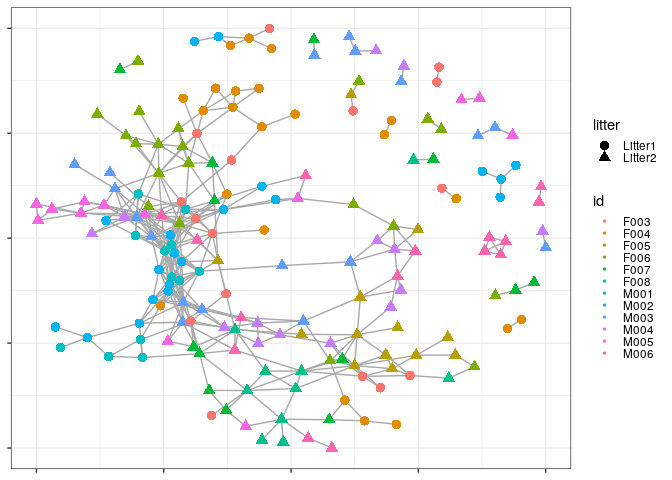<!-- -->

La figure ci-dessus représente le réseau créé par seuillage de la
matrice de dissimilarité de Jaccard Nous voyons le réseau résultant dans
la figure 20 . Les couleurs de la figure représentent la souris d’où
provient l’échantillon et la forme représente la portée dans laquelle se
trouvait la souris. Nous pouvons voir qu’il existe un regroupement des
échantillons par souris et par litter.

## Graph-based two-sample tests

### Minimum Spanning Tree (MST)

on va effetuer un test en utilisant un MST avec une dissemblance
Jaccard. Nous voulons savoir si les deux portées ( family\_relationship)
proviennent de la même distribution. Puisqu’il y a un regroupement dans
les données par individu ( host\_subject\_id), nous ne pouvons pas
simplement permuter toutes les étiquettes, nous devons maintenir cette
structure imbriquée - c’est ce que fait l’ groupingargument. Ici, nous
permutons les étiquettes mais gardons la structure intacte.

``` r
library(phyloseqGraphTest)
gt <- graph_perm_test(ps, "family_relationship", grouping = "host_subject_id",
                      distance = "jaccard", type = "mst")
gt$pval
```

    ## [1] 0.006

``` r
plotNet1=plot_test_network(gt) + theme(legend.text = element_text(size = 8),
        legend.title = element_text(size = 9))
plotPerm1=plot_permutations(gt)
grid.arrange(ncol = 2,  plotNet1, plotPerm1)
```

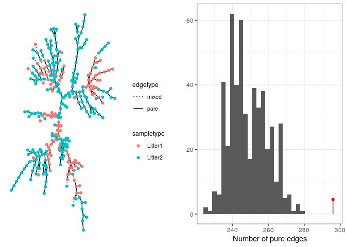<!-- -->

La figure ci-dessus représente le graphique et l’histogramme de
permutation obtenus à partir de l’arbre couvrant minimal avec similitude
Jaccard. Ce test a un petit p-value, et nous rejetons l’hypothèse nulle
que les deux échantillons proviennent de la même distribution. À partir
du graphique de l’arbre couvrant minimum de la figure ci-dessus , nous
voyons à l’œil nu que les échantillons sont groupés par portée plus que
ce à quoi nous nous attendrions par hasard.

### Nearest neighbors

Placer une arête entre deux échantillons chaque fois que l’un d’eux est
dans l’ensemble de k-les voisins les plus proches de l’autre, pour
obtenir le graphe des voisins les plus proches.

``` r
gt <- graph_perm_test(ps, "family_relationship", grouping = "host_subject_id",
                      distance = "jaccard", type = "knn", knn = 1)
```

``` r
plotNet2=plot_test_network(gt) + theme(legend.text = element_text(size = 8),
        legend.title = element_text(size = 9))
plotPerm2=plot_permutations(gt)
grid.arrange(ncol = 2,  plotNet2, plotPerm2)
```

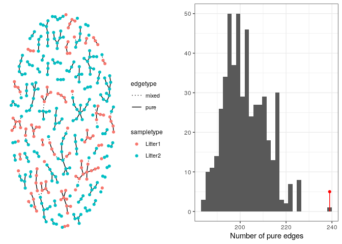<!-- -->

cette figure représente k = 1 réseau du plus proche voisin et
histogramme de permutation Nous voyons à partir de cette figure que si
une paire d’échantillons a un bord entre eux dans le graphique du plus
proche voisin, ils sont extrêmement susceptibles d’être dans la même
portée.

## Linear modeling

Il est souvent intéressant d’évaluer dans quelle mesure la diversité des
communautés microbiennes reflète les caractéristiques de l’environnement
à partir duquel elles ont été prélevées. Contrairement à l’ordination,
le but de cette analyse n’est pas de développer une représentation de
nombreuses bactéries par rapport aux caractéristiques de l’échantillon;
il s’agit plutôt de décrire comment une mesure unique de la structure
globale de la communauté \[^ 1\] est associée aux caractéristiques de
l’échantillon. Il s’agit d’un objectif statistique un peu plus
simple, et peut être abordé par la modélisation linéaire, pour laquelle
il existe une gamme d’approches dans R. À titre d’exemple, nous
utiliserons un modèle à effets mixtes pour étudier la relation entre la
diversité de la communauté microbienne de la souris et la les variables
d’âge et de portée sur lesquelles nous nous sommes concentrés jusqu’à
présent. Ce choix a été motivé par l’observation que les souris plus
jeunes ont des diversités de Shannon sensiblement plus faibles, mais que
différentes souris ont des diversités de base différentes. Le modèle à
effets mixtes est un point de départ pour formaliser cette observation.

Nous calculons d’abord la diversité de Shannon associée à chaque
échantillon et la joignons avec l’annotation d’échantillon.

``` r
library("nlme")
library("reshape2")
ps_alpha_div <- estimate_richness(ps, split = TRUE, measure = "Shannon")
ps_alpha_div$SampleID <- rownames(ps_alpha_div) %>%
  as.factor()
ps_samp <- sample_data(ps) %>%
  unclass() %>%
  data.frame() %>%
  left_join(ps_alpha_div, by = "SampleID") %>%
  melt(measure.vars = "Shannon",
       variable.name = "diversity_measure",
       value.name = "alpha_diversity")

# reorder's facet from lowest to highest diversity
diversity_means <- ps_samp %>%
  group_by(host_subject_id) %>%
  summarise(mean_div = mean(alpha_diversity)) %>%
  arrange(mean_div)
ps_samp$host_subject_id <- factor(ps_samp$host_subject_id)
#                                  diversity_means$host_subject_id)
```

Définir un nouvelle variable alpha\_div, et on assigne à cette variable
la valeur du résultat de la fonction lme(), cette fonction correspond à
un modèle linéaire à effets mixtes dans la formulation décrite dans
Laird et Ware (1982), mais en tenant compte des effets aléatoires
imbriqués. Les erreurs intra-groupe peuvent être corrélées et / ou avoir
des variances inégales. après on définit une nouvelle new\_data, et on
assigne à cette variable la valeur du résultat de la fonction
expand.grid() qui va permettre de créer un bloc de données à partir de
toutes les combinaisons des vecteurs ou facteurs fournis.

``` r
alpha_div_model <- lme(fixed = alpha_diversity ~ age_binned, data = ps_samp,
                       random = ~ 1 | host_subject_id)
new_data <- expand.grid(host_subject_id = levels(ps_samp$host_subject_id),
                        age_binned = levels(ps_samp$age_binned))
```

La synthaxe new\_data$pred indique que nous allons chercher

``` r
new_data$pred <- predict(alpha_div_model, newdata = new_data)
X <- model.matrix(eval(eval(alpha_div_model$call$fixed)[-2]),
                  new_data[-ncol(new_data)])
pred_var_fixed <- diag(X %*% alpha_div_model$varFix %*% t(X))
new_data$pred_var <- pred_var_fixed + alpha_div_model$sigma ^ 2
```

valeurs ajustées, avec barres d’erreur on va utiliser la fonction ggplot
pour créer un nouveau ggplot la fonction geom\_errorbar qui permet de
représenter de Différentes manières un intervalle vertical défini par x=
age\_binned, ymin = pred - 2 et ymax= pred + 2. Chaque cas dessine un
seul objet graphique. la fonction geom\_point va permettre de créer des
nuages de points. Le nuage de points est le plus utile pour afficher la
relation entre deux variables continues.

``` r
# fitted values, with error bars
ggplot(ps_samp %>% left_join(new_data)) +
  geom_errorbar(aes(x = age_binned, ymin = pred - 2 * sqrt(pred_var),
                    ymax = pred + 2 * sqrt(pred_var)),
                col = "#858585", size = .1) +
  geom_point(aes(x = age_binned, y = alpha_diversity,
                 col = family_relationship), size = 0.8) +
  facet_wrap(~host_subject_id) +
  scale_y_continuous(limits = c(2.4, 4.6), breaks = seq(0, 5, .5)) +
  scale_color_brewer(palette = "Set2") +
  labs(x = "Binned Age", y = "Shannon Diversity", color = "Litter") +
  guides(col = guide_legend(override.aes = list(size = 4))) +
  theme(panel.border = element_rect(color = "#787878", fill = alpha("white", 0)),
        axis.text.x = element_text(angle = -90, size = 6),
        axis.text.y = element_text(size = 6))
```

    ## Joining, by = c("host_subject_id", "age_binned")

<!-- -->

## Hierarchical multiple testing

Le test d’hypothèse peut être utilisé pour identifier les microbes
individuels dont l’abondance est liée à des variables d’échantillons
d’intérêt. on va l’utiliser pour tester l’association entre
l’abondance microbienne et l’âge. Cela fournit une vue complémentaire
des analyses précédentes, identifiant les bactéries individuelles
responsables des différences entre les souris jeunes et âgées.

``` r
library("reshape2")
library("DESeq2")
library(GenomicRanges)
#New version of DESeq2 needs special levels
sample_data(ps)$age_binned <- cut(sample_data(ps)$age,
                          breaks = c(0, 100, 200, 400))
levels(sample_data(ps)$age_binned) <- list(Young100="(0,100]", Mid100to200="(100,200]", Old200="(200,400]")
sample_data(ps)$family_relationship = gsub(" ", "", sample_data(ps)$family_relationship)
ps_dds <- phyloseq_to_deseq2(ps, design = ~ age_binned + family_relationship)

# geometric mean, set to zero when all coordinates are zero
geo_mean_protected <- function(x) {
  if (all(x == 0)) {
    return (0)
  }
  exp(mean(log(x[x != 0])))
}

geoMeans <- apply(counts(ps_dds), 1, geo_mean_protected)
ps_dds <- estimateSizeFactors(ps_dds, geoMeans = geoMeans)
ps_dds <- estimateDispersions(ps_dds)
abund <- getVarianceStabilizedData(ps_dds)
```

nous raccourcissons d’abord les noms de chaque taxon / ASV.

``` r
short_names <- substr(rownames(abund), 1, 5)%>%
  make.names(unique = TRUE)
rownames(abund) <- short_names
```

``` r
abund_sums <- rbind(data.frame(sum = colSums(abund),
                               sample = colnames(abund),
                               type = "DESeq2"),
                    data.frame(sum = rowSums(otu_table(pslog)),
                               sample = rownames(otu_table(pslog)),
                               type = "log(1 + x)"))

ggplot(abund_sums) +
  geom_histogram(aes(x = sum), binwidth = 20) +
  facet_grid(type ~ .) +
  xlab("Total abundance within sample")
```

<!-- -->
L’histogramme sur le dessus donne l’abondance totale transformée DESeq2
dans chaque échantillon. la procédure de test hiérarchique nécessite des
tests univariés pour chaque groupe taxonomique de niveau supérieur, pas
seulement pour toutes les espèces. Une fonction d’assistance,,
treePValuesest disponible pour cela; il attend une edgelist encodant les
relations parent-enfant, la première ligne spécifiant le nœud racine.

``` r
library("structSSI")
el <- phy_tree(pslog)$edge
el0 <- el
el0 <- el0[nrow(el):1, ]
el_names <- c(short_names, seq_len(phy_tree(pslog)$Nnode))
el[, 1] <- el_names[el0[, 1]]
el[, 2] <- el_names[as.numeric(el0[, 2])]
unadj_p <- treePValues(el, abund, sample_data(pslog)$age_binned)
```

Nous pouvons maintenant corriger p-valeur en utilisant la procédure de
test hiérarchique.

``` r
hfdr_res <- hFDR.adjust(unadj_p, el, .75)
summary(hfdr_res)
```

    ## Number of hypotheses: 764 
    ## Number of tree discoveries: 579 
    ## Estimated tree FDR: 1 
    ## Number of tip discoveries: 280 
    ## Estimated tips FDR: 1 
    ## 
    ##  hFDR adjusted p-values: 
    ##                 unadjp         adjp adj.significance
    ## GCAAG.95  1.861873e-82 3.723745e-82              ***
    ## GCAAG.70  1.131975e-75 2.263950e-75              ***
    ## GCAAG.187 5.148758e-59 1.029752e-58              ***
    ## GCAAG.251 3.519276e-50 7.038553e-50              ***
    ## GCAAG.148 1.274481e-49 2.548962e-49              ***
    ## GCAAG.30  9.925218e-49 1.985044e-48              ***
    ## GCGAG.76  1.722591e-46 3.445183e-46              ***
    ## GCAAG.167 6.249050e-43 1.249810e-42              ***
    ## 255       8.785479e-40 1.757096e-39              ***
    ## GCAAG.64  2.727610e-36 5.455219e-36              ***
    ## [only 10 most significant hypotheses shown] 
    ## --- 
    ## Signif. codes:  0 '***' 0.015 '**' 0.15 '*' 0.75 '.' 1.5 '-' 1

``` r
#interactive part: not run
plot(hfdr_res, height = 5000) # opens in a browser
```

``` r
tax <- tax_table(pslog)[, c("Family", "Genus")] %>%
  data.frame()
tax$seq <- short_names
options(digits=3)
hfdr_res@p.vals$seq <- rownames(hfdr_res@p.vals)
tax %>%
  left_join(hfdr_res@p.vals) %>%
  arrange(adjp) %>% head(10)
```

    ## Joining, by = "seq"

    ##             Family            Genus       seq   unadjp     adjp
    ## 1  Lachnospiraceae             <NA>  GCAAG.95 1.86e-82 3.72e-82
    ## 2  Lachnospiraceae        Roseburia  GCAAG.70 1.13e-75 2.26e-75
    ## 3  Lachnospiraceae Clostridium_XlVa GCAAG.187 5.15e-59 1.03e-58
    ## 4  Lachnospiraceae             <NA> GCAAG.251 3.52e-50 7.04e-50
    ## 5  Lachnospiraceae Clostridium_XlVa GCAAG.148 1.27e-49 2.55e-49
    ## 6  Lachnospiraceae             <NA>  GCAAG.30 9.93e-49 1.99e-48
    ## 7  Ruminococcaceae     Ruminococcus  GCGAG.76 1.72e-46 3.45e-46
    ## 8  Lachnospiraceae Clostridium_XlVa GCAAG.167 6.25e-43 1.25e-42
    ## 9  Lachnospiraceae        Roseburia  GCAAG.64 2.73e-36 5.46e-36
    ## 10            <NA>             <NA>   GCAAG.1 5.22e-35 1.04e-34
    ##    adj.significance
    ## 1               ***
    ## 2               ***
    ## 3               ***
    ## 4               ***
    ## 5               ***
    ## 6               ***
    ## 7               ***
    ## 8               ***
    ## 9               ***
    ## 10              ***

Il semble que les bactéries les plus fortement associées appartiennent
toutes à la famille des Lachnospiracées , ce qui est cohérent avec les
résultats aléatoires de la forêt.

# Multitable techniques

Ici, nous nous concentrerons sur un flux de travail spécifique qui
utilise une analyse de corrélation canonique clairsemée (CCA
clairsemée), une méthode bien adaptée à la fois aux comparaisons
exploratoires entre échantillons et à l’identification de
caractéristiques présentant des variations intéressantes. Nous
utiliserons une implémentation de la PMA. Le code ci-dessous récupère et
filtre ces données.

``` r
metab <- read.csv("https://raw.githubusercontent.com/spholmes/F1000_workflow/master/data/metabolites.csv",row.names = 1)
microbe_connect <-url("https://raw.githubusercontent.com/spholmes/F1000_workflow/master/data/microbe.rda")
load(microbe_connect)
microbe
```

    ## phyloseq-class experiment-level object
    ## otu_table()   OTU Table:         [ 20609 taxa and 12 samples ]
    ## tax_table()   Taxonomy Table:    [ 20609 taxa by 6 taxonomic ranks ]
    ## phy_tree()    Phylogenetic Tree: [ 20609 tips and 20607 internal nodes ]

Nous voyons que microbec’est un phyloseqobjet. Notre prétraitement
reflète celui des données de la souris. Nous filtrons d’abord les
microbes et les métabolites d’intérêt, en supprimant ceux qui sont nuls
sur de nombreux échantillons.

``` r
library("genefilter")
keep_ix <- rowSums(metab == 0) <= 3
metab <- metab[keep_ix, ]
microbe <- prune_taxa(taxa_sums(microbe) > 4, microbe)
microbe <- filter_taxa(microbe, filterfun(kOverA(3, 2)), TRUE)
metab <- log(1 + metab, base = 10)
X <- otu_table(microbe)
X[X > 50] <- 50
dim(X)
```

    ## [1] 174  12

Ensuite, nous les transformons pour affaiblir les queues lourdes. Nous
prenons également le journal des métabolites.

``` r
dim(metab)
```

    ## [1] 405  12

Nous voyons que X et metab ont 12 colonnes, ce sont en fait les
échantillons et nous les transposerons.

Nous pouvons maintenant appliquer une CCA clairsemée. Cette méthode
compare des ensembles d’entités dans des tables de données de grande
dimension, où il peut y avoir plus d’entités mesurées que
d’échantillons.

Notre implémentation est ci-dessous. Les paramètres penaltyxet
penaltyzsont des pénalités de parcimonie.

``` r
library(PMA)
cca_res <- CCA(t(X),  t(metab), penaltyx = .15, penaltyz = .15)
```

    ## 123456789101112131415

Consultons la documentation du CCAdans le package PMA .

``` r
cca_res
```

    ## Call: CCA(x = t(X), z = t(metab), penaltyx = 0.15, penaltyz = 0.15)
    ## 
    ## 
    ## Num non-zeros u's:  5 
    ## Num non-zeros v's:  15 
    ## Type of x:  standard 
    ## Type of z:  standard 
    ## Penalty for x: L1 bound is  0.15 
    ## Penalty for z: L1 bound is  0.15 
    ## Cor(Xu,Zv):  0.974

5 microbes et 15 métabolites ont été sélectionnés, en fonction de leur
capacité à expliquer la covariation entre les tableaux. De plus, ces 20
caractéristiques entraînent une corrélation de 0,974 entre les deux
tableaux. Nous interprétons cela comme signifiant que les données
microbiennes et métabolomiques reflètent des signaux sous-jacents
similaires, et que ces signaux peuvent être bien approximés par les 20
caractéristiques sélectionnées.

Pour relier les métabolites et OTU récupérés aux caractéristiques des
échantillons sur lesquels ils ont été mesurés, nous les utilisons comme
intrants dans un PCA ordinaire.

``` r
combined <- cbind(t(X[cca_res$u != 0, ]),
                  t(metab[cca_res$v != 0, ]))
pca_res <- dudi.pca(combined, scannf = F, nf = 3)
```

``` r
genotype <- substr(rownames(pca_res$li), 1, 2)
sample_type <- substr(rownames(pca_res$l1), 3, 4)
feature_type <- grepl("\\.", colnames(combined))
feature_type <- ifelse(feature_type, "Metabolite", "OTU")
sample_info <- data.frame(pca_res$li, genotype, sample_type)
feature_info <- data.frame(pca_res$c1,
                           feature = substr(colnames(combined), 1, 6))
```

``` r
ggplot() +  geom_point(data = sample_info,
            aes(x = Axis1, y = Axis2, col = sample_type, shape = genotype), size = 3) + 
  geom_label_repel(data = feature_info,
                   aes(x = 5.5 * CS1, y = 5.5 * CS2, label = feature, fill = feature_type),
                   size = 2, segment.size = 0.3,
                   label.padding = unit(0.1, "lines"), label.size = 0) +
  geom_point(data = feature_info,
             aes(x = 5.5 * CS1, y = 5.5 * CS2, fill = feature_type),
             size = 1, shape = 23, col = "#383838") +
  scale_color_brewer(palette = "Set2") +
  scale_fill_manual(values = c("#a6d854", "#e78ac3")) +
  guides(fill = guide_legend(override.aes = list(shape = 32, size = 0))) +
  coord_fixed(sqrt(pca_res$eig[2] / pca_res$eig[2])) +
  labs(x = sprintf("Axis1 [%s%% Variance]",
                   100 * round(pca_res$eig[1] / sum(pca_res$eig), 2)),
       y = sprintf("Axis2 [%s%% Variance]",
                   100 * round(pca_res$eig[2] / sum(pca_res$eig), 2)),
       fill = "Feature Type", col = "Sample Type")
```

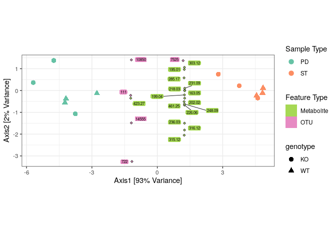<!-- -->

La figure affiche un triplot PCA , où nous montrons différents types
d’échantillons et les caractéristiques multidomaines (métabolites et
OTU). Cela permet une comparaison entre les échantillons mesurés -
triangles pour Knockout et cercles pour le type sauvage - et caractérise
l’influence des différentes caractéristiques - des losanges avec des
étiquettes de texte. Par exemple, nous voyons que la principale
variation des données se situe entre les échantillons PD et ST, qui
correspondent aux différents régimes.
